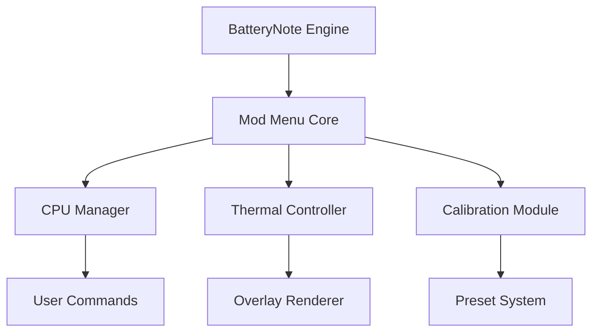

# BatteryNote Mod Menu 🔋

The **BatteryNote Mod Menu** transforms your energy management workflow into a fully interactive control hub. Designed for performance tuners, creators, and system optimizers, it introduces an elegant in-game–style overlay that lets you manage BatteryNote’s parameters live — from thermal curves to refresh rates — without restarting or editing system settings.

It’s the ultimate interface for balancing performance, longevity, and noise in one streamlined panel.

---

## 🧭 Overview

The **BatteryNote Mod Menu** enhances your power monitoring experience by providing a unified overlay for all energy and thermal functions. No more tabbing through settings — instantly adjust CPU efficiency, battery refresh intervals, cooling thresholds, or live readout themes from one compact interface.

[!IMPORTANT]

> All modifications are **session-based** — they reset when BatteryNote or your system restarts, ensuring full safety and no permanent hardware impact.

---

## ⚙️ Feature Highlights

* **⚡ Real-Time CPU Scaling:** Change performance boost factors dynamically.
* **🌡 Thermal Curve Manager:** Modify temperature-triggered fan ramps or throttling limits.
* **🔋 Smart Calibration Mode:** Refresh battery wear data and balance charge cycles instantly.
* **🕒 Data Refresh Rate Control:** Choose how often BatteryNote updates live readings.
* **💻 Power Plan Integration:** Toggle between Balanced, Performance, or Eco modes directly in the overlay.
* **🎨 Overlay Customizer:** Personalize colors, layouts, and transparency for your workspace aesthetic.

Example Config:

```ini
[MOD_MENU]
CPUBoost=1.1
ThermalLimit=80
RefreshRate=2
SmartCalibration=True
PowerMode=Performance
OverlayTheme=Dark
```

[!NOTE]

> All parameters can be saved into quick profiles stored under `/BatteryNote/config/mod_presets/`.

---

## 🧰 Setup Instructions

1. **Download** and extract the verified Mod Menu build.
2. **Place** it in your *BatteryNote* directory.
3. **Run** `BatteryNote_ModMenu.exe` as Administrator.
4. **Launch BatteryNote**, then press `F1` to open the overlay.
5. **Navigate** with your keyboard or mouse to adjust parameters live.

Command Example:

```bash
BatteryNote_ModMenu.exe /preset="EcoMode.cfg"
```

[!WARNING]

> Avoid running other hardware monitoring overlays (MSI Afterburner, HWInfo OSD) simultaneously to prevent UI overlap.

---

## 💻 Compatibility

| Platform          | Status | Notes                                  |
| ----------------- | ------ | -------------------------------------- |
| Windows 10/11     | ✅      | Fully Supported                        |
| Laptop Devices    | ✅      | Optimized for battery-equipped systems |
| Desktop Systems   | ⚙️     | Limited battery calibration support    |
| BatteryNote v2.0+ | ✅      | Fully compatible                       |
| Controller Input  | ✅      | Menu navigation supported              |

Accessibility: High-contrast UI, text scaling, colorblind presets, and keyboard navigation built-in.

---

## 🧩 System Flow Diagram



---

## 🧠 Custom Presets

**Eco Mode (Battery Saver)**

```ini
[PRESET_ECO]
CPUBoost=0.8
ThermalLimit=70
RefreshRate=4
SmartCalibration=True
PowerMode=Balanced
OverlayTheme=Light
```

**Performance Mode (High Output)**

```ini
[PRESET_PERFORMANCE]
CPUBoost=1.3
ThermalLimit=85
RefreshRate=1
SmartCalibration=False
PowerMode=Performance
OverlayTheme=Dark
```

**Quiet Mode (Fan Minimal)**

```ini
[PRESET_QUIET]
CPUBoost=0.9
ThermalLimit=65
RefreshRate=2
SmartCalibration=True
PowerMode=Eco
OverlayTheme=Blue
```

Switch between presets instantly using hotkeys `F2`, `F3`, or `F4`.

---

## 💬 FAQ

**Q: Does this replace BatteryNote’s default UI?**
A: No, it runs alongside and overlays additional controls.

**Q: Is it safe for laptop batteries?**
A: Yes — it operates within BatteryNote’s safe limits and resets after exit.

**Q: Can it auto-load a preset on startup?**
A: Yes, include `/auto` in your launch command.

**Q: Does it affect system warranties?**
A: No — the Mod Menu makes no permanent hardware or BIOS changes.

**Q: Can I log session data?**
A: Absolutely. Enable the `DataLogger=True` flag to record metrics to CSV.

---

## 🚀 Update Roadmap

| Version | Feature                      | Status     |
| ------- | ---------------------------- | ---------- |
| v1.5    | Auto Thermal Curve Detection | ✅ Released |
| v1.6    | Cross-Device Sync Profiles   | 🚧 Testing |
| v1.7    | Cloud Preset Sharing         | 🧩 Planned |

---

## 🏁 Final Thoughts

The **BatteryNote Mod Menu** redefines performance management, giving you precise and flexible power tuning directly from a unified overlay. Whether you’re optimizing a gaming laptop, testing battery efficiency, or managing workloads, it turns BatteryNote into a fully interactive control system.

Balance your energy. Maximize efficiency. Control your power.

---
